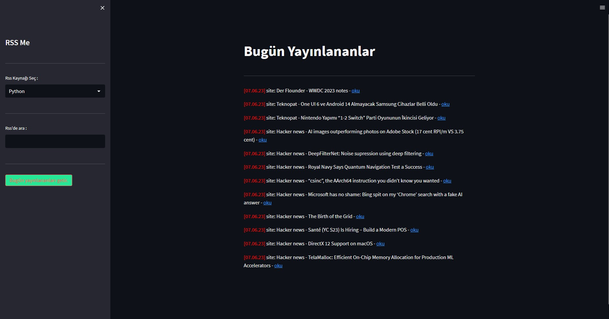

The rss you want is on RSS-me.

## Screenshots




## Run Locally

Clone the project

```bash
  git clone https://github.com/SerhatYildrm/RSS-me.git
```

Go to the project directory

```bash
  cd RSS-me
```

Install dependencies

```bash
  pip install streamlit
  pip install feedparser
```

Start the server

```bash
  ./rssme.bat
```

